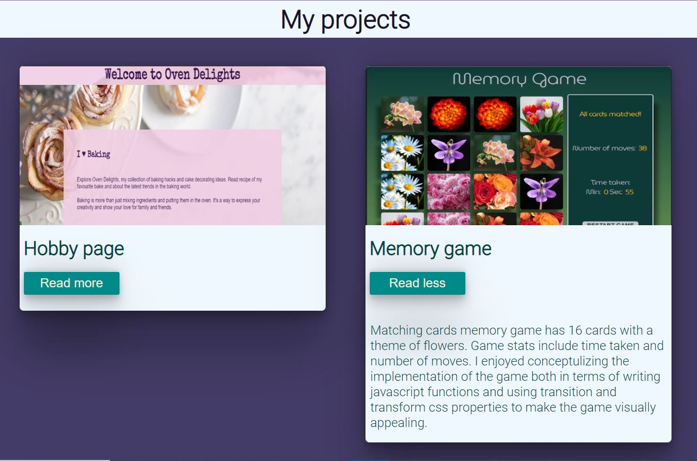

# Project Gallery

## Description

Project Gallery is a collection of my projects in HTML, CSS and Javascript. Information about each project is displayed on a card. The cards show a picture of the project with the projects name as a title. The user can click a `Read more` button to read a project overview. A `Read less` button closes the descriptio panel. Cards are displayed in CSS flex layout. Cards are displayed in a single column on mobile devices.Image of the project serves as a link to the project website.

## Projects

Projects included are:  
[Website](https://pip.pypa.io/en/stable/) my application website.  
[Game](https://pip.pypa.io/en/stable/) matching memory game.  
[Movie](https://pip.pypa.io/en/stable/) movie data website.  
[Hobby](https://pip.pypa.io/en/stable/) my hobby page.

## Learnings

\* I wanted to use the project images as background so I added them in CSS and used span tag with an aria label in HTML.

\* To highlight a card on selection I gave a hover effect to change the card background colour. I used transform and transition properties to bring focus to the cards in a smooth gentle way.

\* When the user would click the `Read More` button on a card the adjacent card's height would get increased in the laptop layout. So I learnt to use `width: fit-content;` to ensure this would not happen.

\* I created an `active` class with display set to block to toggle the display of the description text, when adding an event listener on the `Read More` buttons. I used the `nextElementSibling` property to do so.

\* Lastly I used media queries to make the page responsive.
